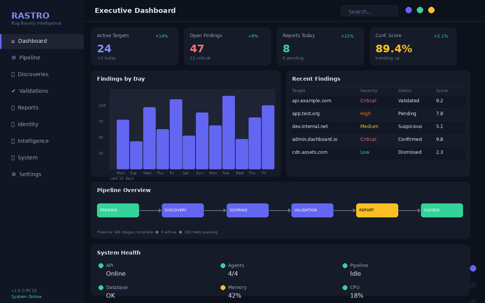
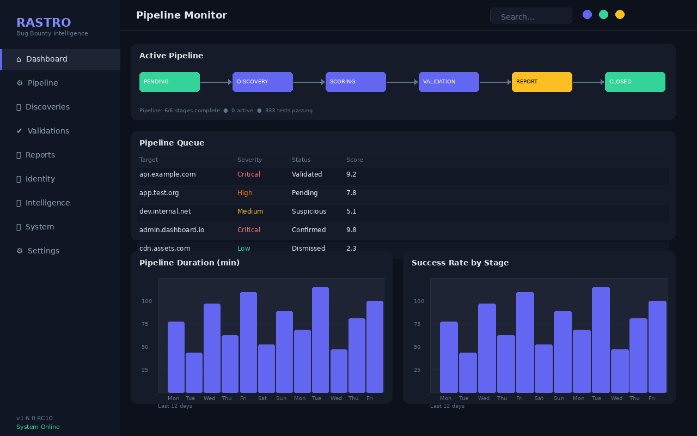
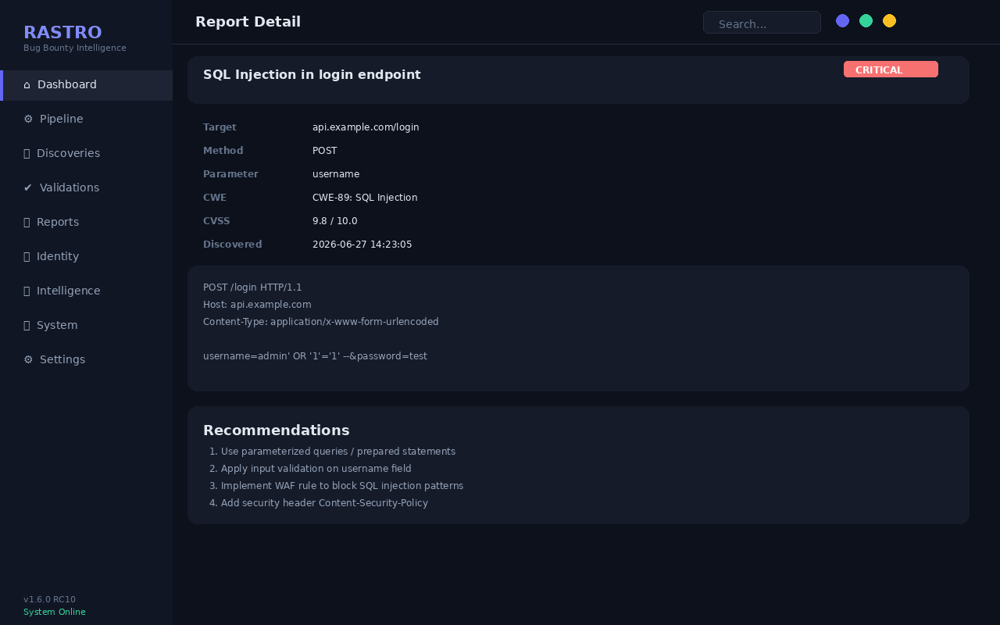
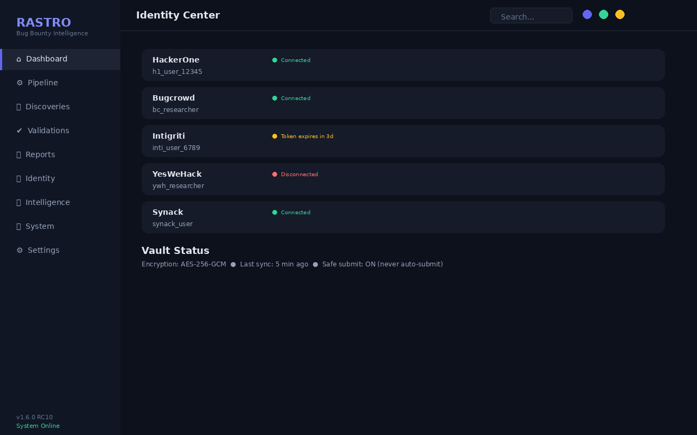
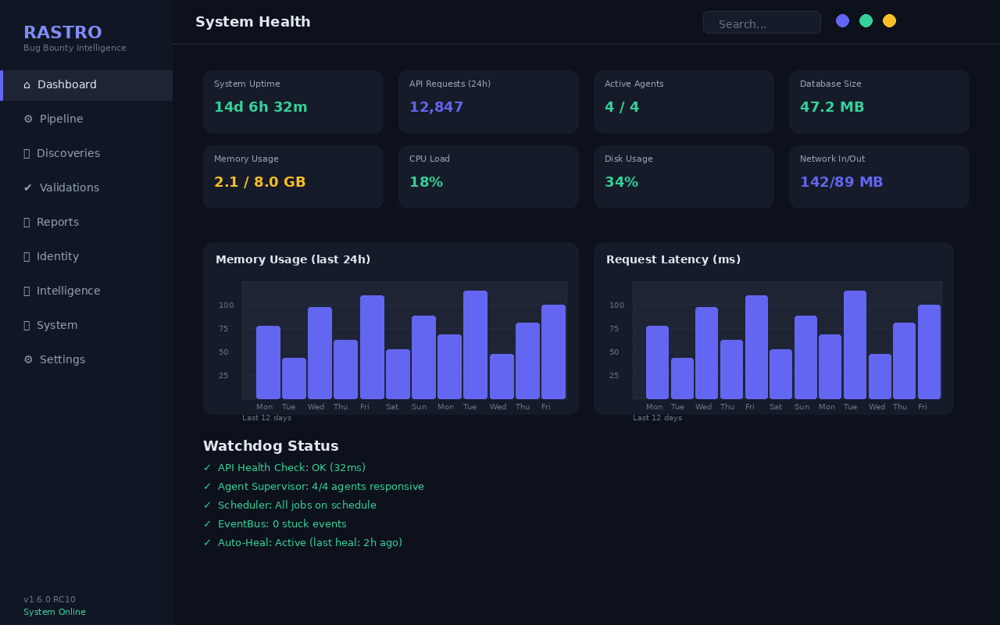

<p align="center">
  
  
  
  
</p>

<h1 align="center">Rastro</h1>
<p align="center"><em>Autonomous Bug Bounty Intelligence System</em></p>

<p align="center">
  Discover. Score. Validate. Report.<br>
  Your entire bug bounty workflow, automated and running 100% locally.
</p>

---

## Demo

<p align="center">
  
  <br>
  <em>Executive Dashboard — real-time intelligence at a glance</em>
</p>

<p align="center">
  
  <br>
  <em>Pipeline Monitor — track every stage of the discovery process</em>
</p>

---

## Features

| | |
|---|---|
| **Autonomous AI Pipeline** | End-to-end orchestration from target discovery to report submission |
| **Multi-Platform Integration** | HackerOne, Bugcrowd, Intigriti, YesWeHack, Synack |
| **Smart Scoring Engine** | Deterministic heuristic scoring with 15+ signals and confidence gating |
| **Evidence Graph** | Map relationships between findings, endpoints, and attack surfaces |
| **Auto-Healing System** | Self-recovering pipeline with internal watchdog and health monitoring |
| **Professional Reports** | HackerOne/Bugcrowd-ready exports, PDF, Markdown |
| **Identity Vault** | AES-256-GCM encrypted credentials with safe-submit guard |
| **Desktop Native** | System tray, Windows Service, auto-update, offline-capable |

---

## Architecture

```
Browser / Desktop App
       |
   FastAPI Backend (47 routers / ~240 endpoints)
       |
   AuthMiddleware -> RateLimitMiddleware -> CORSMiddleware
       |
   Orchestrator -> Agents -> Pipeline (11 states)
       |
   Recon -> Scoring -> Evidence -> Validation -> Report
       |
   SQLite / PostgreSQL (SQLAlchemy)
```

**Frontend**: React 19 + TypeScript + Vite 8 + PrimeReact dark theme

**Desktop**: pywebview + pystray + PyInstaller (single binary)

---

## Quick Start

```bash
# 1. Install dependencies
python run.py --install

# 2. Start the system
python run.py --tray

# 3. Open dashboard
#    http://127.0.0.1:8000
```

Or launch in browser mode:

```bash
python run.py --browser
```

### Get started in 30 seconds

```
1. git clone https://github.com/AdriDob/rastrohunteralpha.git
2. python run.py --install
3. Open http://127.0.0.1:8000
4. Done.
```

---

## More Screenshots

<p align="center">
  
  
  
</p>

---

## Status

| | |
|---|---|
| **Version** | 1.6.0 RC10 |
| **Tests** | 333+ passing (pytest) |
| **Pipeline** | 11 stages, fully deterministic |
| **Agents** | 4 specialized agents (Coordinator, Financial, Memory, Exploit) |
| **Runtime** | Local only — no cloud dependency, no data exfiltration |

---

## Project Structure

```
/
├── api/              FastAPI backend (47 routers, ~240 routes)
├── core_engines/     Intelligence core (recon, scoring, validation, evidence, reporting, AI, auth, license)
├── frontend/         React + TypeScript + Vite dashboard
├── desktop/          Desktop app (pywebview, tray, watchdog, updater, Windows Service)
├── database/         SQLAlchemy models + SQLite/PostgreSQL
├── scripts/          Build and utility scripts
├── tests/            Test suite (pytest)
├── docs/             Documentation
├── screenshots/      Product screenshots
├── installer/        Windows installer (NSIS)
└── run.py            Single entrypoint
```

---

## Links

- [Changelog](CHANGELOG.md)
- [License](LICENSE)
- [Installation Guide](docs/)

---

<p align="center"><em>Built for serious bug bounty researchers.</em></p>
